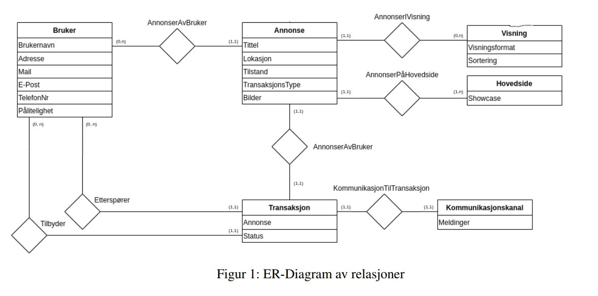

# Swap
Appen Swap skal gjøre det mulig for brukere å bytte eller gi bort ting. Målgruppen er studenter. 

## Brukerhistorier

- Det skal være mulig å registere en bruker, og logge inn til en allerede eksisterende bruker.
- Annonser skal kunne opprettes av brukere. En annonse skal inneholde:
    1. Tittel
    2. Beskrivelse
    3. Om gjenstanden gis bort, lånes, byttes, eller ønskes
    4. bilde
- Brukere skal kunne sende meldinger til hverandre for å avtale transaksjoner og møter
- Visning av annonser, med muligheter for sortering
- Brukere skal kunne se tidligere transaksjoner

## Refleksjon om lagringsmetode

Appen vår bruker implisitt lagring.
Vi har valgt dette fordi det er mer hensiktsmessig i Swapp! å ha lagring som skjer uten at man selv må administrere filer.
når man registrerer en bruker, lagres det når man trykker på Register, og videre skal vi implementere lagring av byttehandler.
 De er heller ikke er nødvendig at brukeren selv lagrer med navn etc, men mer fornuftig at appen lagrer.

## Relasjoner
