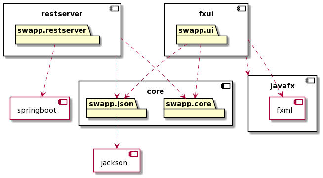
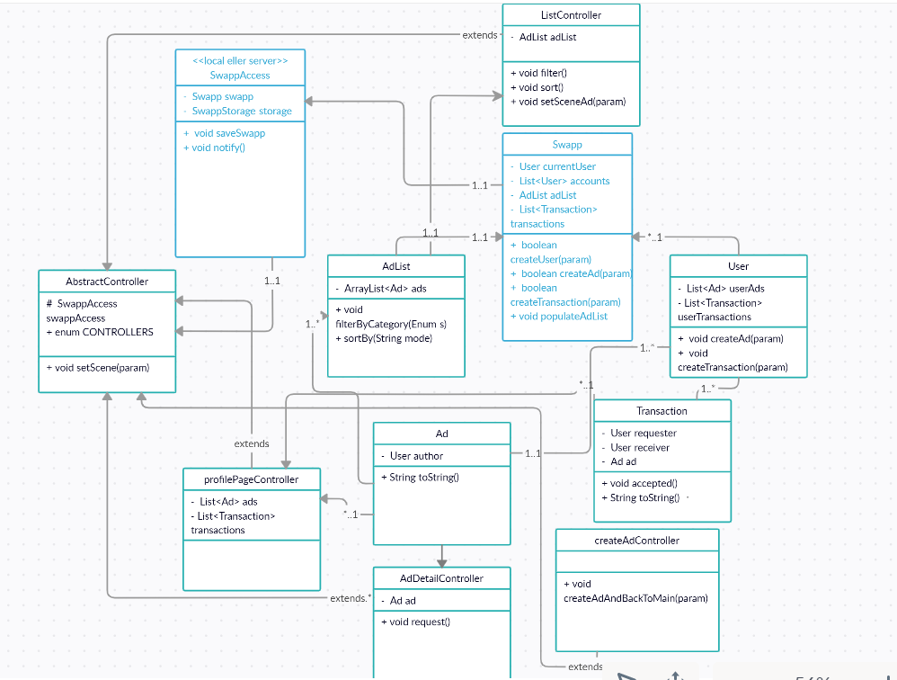

# SWAPP
Appen Swap skal gjøre det mulig for brukere å bytte eller gi bort ting. Målgruppen er studenter.
**[Se her for flere detaljer om hva appen handler om.](OM_PROSJEKTET.md)**

## Pakkediagram

## Pakkediagram

# Maven-kommandoer
- mvn clean install 

- mvn test (Kjører alle tester)

- mvn -e javafx:run -rf :fxui (kjører appen, også mulig å skrive cd fxui; mvn javafx:run)

- mvn jacoco:report (test coverage)

- mvn checkstyle:check  (Kjør spotbugs)

- mvn spotbugs:check
- mvn -pl MODULENAME -Dtest=CLASSNAME test  (Test en enkelt klasse)

###Kjente problemer
TestFX-testene bygger ikke alltid i gitpod. Dette har med at flere tråder laget av testFX gir udeterministisk rekkefølge.
